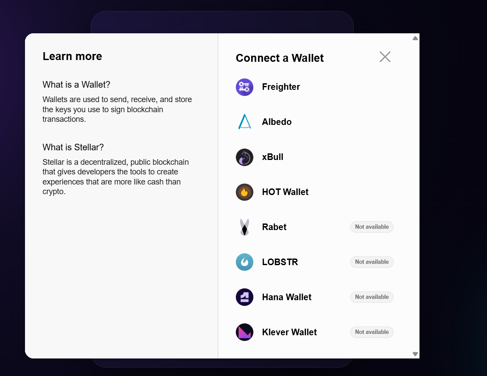

# 📝 On-Chain Message Board

A decentralized message board built on the **Stellar** blockchain. Connect your wallet, post a message, and it lives forever on-chain. Anyone can read every message directly from the smart contract.

Built for the **Stellar Journey to Mastery** program — 🟡 Yellow Belt submission.

## ✨ Features

- 🔗 **Multi-wallet support** via Stellar Wallets Kit (Freighter, xBull, Albedo, and more)
- ✍️ **Write to the contract** — post a message with the `add_message` function
- 📖 **Read from the contract** — all messages are fetched with `get_messages`
- ⏳ **Live transaction status** — pending / success / failed
- 🛡️ **Error handling** — wallet not found, user rejection, and empty/invalid input
- 🔄 **Auto-refresh** — the message list updates automatically after a successful post

## 🛠️ Tech Stack

- React + Vite
- @stellar/stellar-sdk (Soroban RPC)
- @creit.tech/stellar-wallets-kit
- Soroban smart contract (Rust)

## 📜 Deployed Contract (Testnet)

- **Contract address:** CDPOXHURLFAMTGZY3NJ2ITJ3VDU6WB26RGB4KLQNXHSQHEFJZWHEFMUH
- **Explorer:** https://stellar.expert/explorer/testnet/contract/CDPOXHURLFAMTGZY3NJ2ITJ3VDU6WB26RGB4KLQNXHSQHEFJZWHEFMUH

## 🔗 Example Contract Call (Transaction)

- **Transaction hash:** <ec54db859c4e64d3016fb659284d049d796b97cd74160bdede003d3dee2e7501>
- **Explorer:** https://stellar.expert/explorer/testnet/tx/<ec54db859c4e64d3016fb659284d049d796b97cd74160bdede003d3dee2e7501>

## 🖼️ Screenshots

### Wallet options

## 🚀 Getting Started

1. Clone the repository:

        git clone https://github.com/AtomNetw0rk/message-board-dapp.git
        cd message-board-dapp

2. Install dependencies:

        npm install

3. Start the dev server:

        npm run dev

4. Open http://localhost:5173 in your browser.

You need a Stellar wallet (such as Freighter) set to the **Testnet** with a funded account.

## 🧠 How It Works

- **Reading:** the app calls the contract's `get_messages` function with a read-only simulation — no wallet or fee needed.
- **Writing:** the app builds an `add_message` transaction, the connected wallet signs it, and it is sent to the network. The UI polls the transaction until it succeeds, then refreshes the list.

## 📄 License

MIT